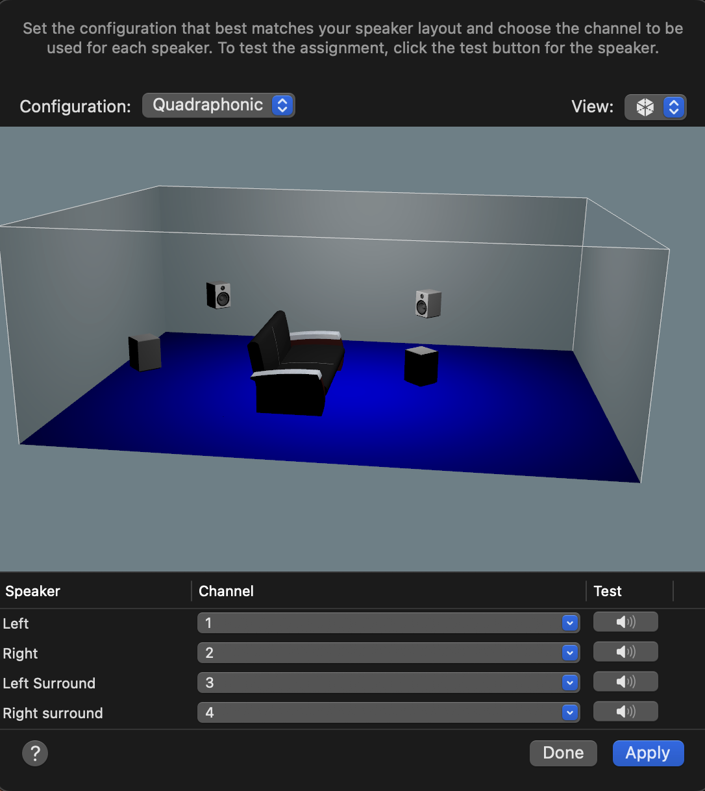
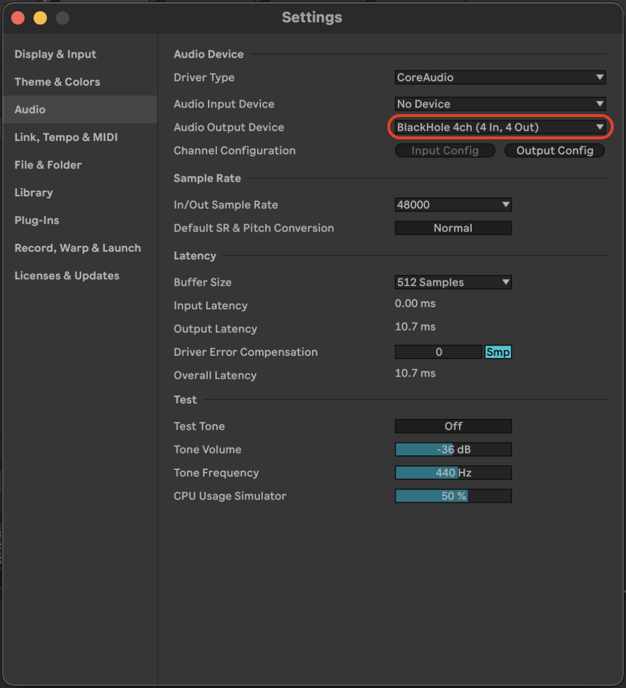
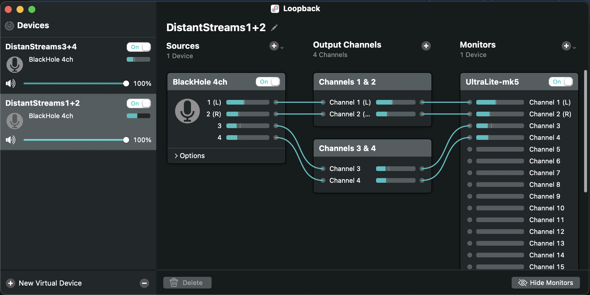
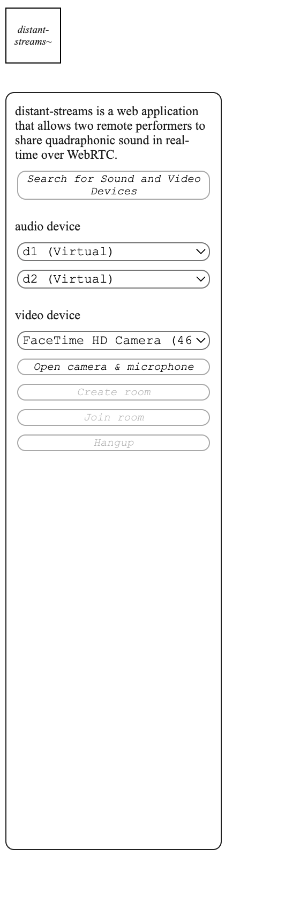

# Distant Streams (Firebase + WebRTC Codelab)

## About
This web application demonstrates realtime bi-directional quadraphonic audio streaming using WebRTC and the WebAudio API. It was built using the the WebRTC [FirebaseRTC example](https://github.com/webrtc/FirebaseRTC). 

This version contains changes to the repo that allows connected users to select two stereo audio devices (currently configured using [Loopback](https://rogueamoeba.com/loopback/)) which are split and sent as 4 distinct mono sound "tracks" of a WebRTC destination stream. 

One day Web standards will allow us to select one audio device with more than two channels, but for now selecting two stereo devices is a manageable workaround.

WebAudio API functions decompose the remote multichannel stream from a peer connection and routes the incoming 4 audio tracks to your soundcard's output channels.

## Usage
You must setup a Firebase/Firestore account to host and deploy the project. More details can be found on the [original example project page](https://webrtc.org/getting-started/firebase-rtc-codelab).

## DAW Setup
You can stream quad from any audio application that allows you to select the audio output destination.

Your multichannel soundcard must be configured as a Quadraphonic output device in your OS system settings.

Download and install the [Blackhole](https://existential.audio/blackhole/).

Blackhole acts as a virtual sound card and should be set as the output device in your DAW. 

(your multichannel soundcard must be configured as a Quadraphonic output device in your OS system settings).

this gets unzipped and placed in your Macintosh HD → Library → Audio → Plugins → HAL

Set ‘Blackhole’ (with more than 2 outputs) as your Output Device.

[Loopback](https://rogueamoeba.com/) is used to create two stereo devices from the 4-channel output from your DAW going to Blackhole.

Be sure to create a Monitor output in Loopback to hear your audio locally. 

## Web Setup
To see the hosted project visit [distant-streams.web.app](https://distant-streams.web.app/).

Click the Distant Streams logo to bring up the configuration panel.

Click the 'Search for Sound and Video Devices' button to and grant the browser permissions.

Select the two stereo Loopback devices and desired video feed.

Click 'Open Camera + Microphone' and Create Room.

Copy and paste the alphanumeric code to share it with your peer. 

The connecting peer should follow the above process but should select 'Join Room' using the key geneated by the caller.

Adjust volume in the web-app's panel to balance levels.